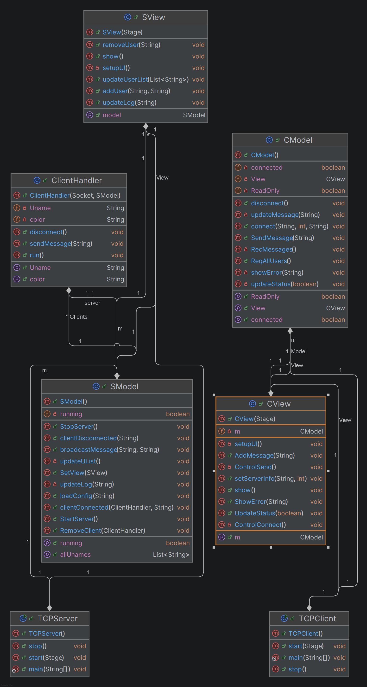

# CSC3374_GroupChatApplication_Project
This mini-project is about Java Sockets by implementing a group chat application using TCP (Transmission Control Protocol) and JavaFX. The application enables real-time communication between multiple clients through a central server.
**The project has Features:**
- Java Sockets (TCP)
- JavaFX for GUI
- Thread-per-connection architecture
- Model-View separation pattern
# Problems that the GroupChatApplication Tackles
The project tackles issues like connection of multiple client to one server and meassage broadcasting form one-to-many ueser at the same time. This means implementation of thread-per-connection model to handle various connections simoultaneously. In addiition, it uses users authentification using their names and restrict to read-only mode when the name is not provided. 

# CSC3374_GroupChatApplication Project Structure
```plaintext
ParadigmsProject/
├── Diagrams                            # UML Class, Deployment, Sequence, and Use-Case diagrams
├── tcp_socket_server/                  # The Server-side application
│   ├── src/main/java/ma/project/
│   │   ├── TCPServer.java
│   │   ├── SModel.java
│   │   ├── SView.java
│   │   └── ClientHandler.java
│   └── pom.xml
├── tcp_socket_client/                  # The Client-side  application
│  ├── src/main/java/ma/project/
│  │   ├── TCPClient.java
│  │   ├── CModel.java
│  │   └── CView.java
│  └── pom.xml
└── Readme.md                           # Project Description
```
##  Interoperability
The poroject is implemented using Java language.
## Requirements for GroupChat Application:
- Java 22 or higher
- JavaFX 21
- Maven 3.6+
  ## Prerequisites of GroupChat Application:
- Java 17 or higher
- JavaFX 17
- Maven
- IntelliJ IDEA

## Installation and Building of the Project (copy-paste commands)

### To build the project you need to run the following commads:

**Server:**
```bash
cd tcp_socket_server
mvn clean package
```

**Client:**
```bash
cd tcp_socket_client
mvn clean package
```

### To Run the Two  Applications

**step 1: Starting the Server first is crucial:**
```bash
cd tcp_socket_server
java -jar target/tcp_socket_server-1.0-SNAPSHOT.jar
```

**Step 2: Starting  Client:**
```bash
cd tcp_socket_client
java -jar target/tcp_socket_client-1.0-SNAPSHOT.jar localhost 3000
```
**Step 3: Alternative method**
Use Directly the Class Files :
```bash
java TCPServer
java TCPClient localhost 3000
```
## Features

- **Multiple Client Support**: Server handles multiple simultaneous connections
- **Username Authentication**: Users must enter username (or connect in read-only mode)
- **Real-time Messaging**: Messages broadcasted to all connected clients
- **User Management**: Server displays all connected users with color coding
- **JavaFX GUI**: Modern graphical interface for both server and client
- **Model-View Separation**: Clean architecture with separated logic and UI


## Usage
- Enter a username to join the chat
- Leave username empty to join in read-only mode
- Type `allUsers` to see all connected users
- Type `end` or `bye` to disconnect

## UML Diagrams
See the `diagrams/` folder for:
- Detailed UML Class Diagram
 
  

- Deployment Diagram for GroupChat Application:
  
- Sequence Diagram
- Use case Diagram

## Author
Amina Lahraoui

